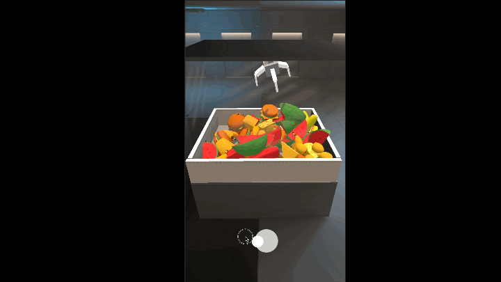

# Showcase

###  Arcade Crane Game
simple crane game inspired by real life arcade version of it.
 Project duration: 3 days

### How to open the game
1. Clone or download this project
2. Open with Unity Engine 2021.3.45f1
3. Open Assets/Core/_Scene/Core.scene
4. Hit play button

### Player Actions
control the crank with touchscreen or keyboard
****Touchscreen
1. Press & hold the screen and move your finger to move the crane
2. Tap to catch item.
**** Keyboard
1. use W,A,S,D to move
2. Press spacebar to catch item

### Tools
1. Unity Engine 2021.3.45f1
2. Dotween
